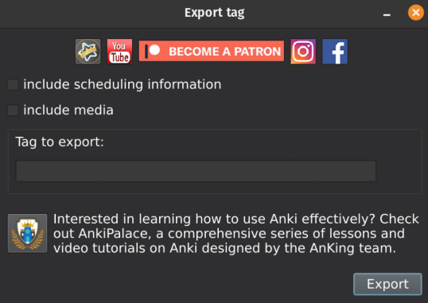

## anki-export-tag
This add-on enables you to easily share tags with other Anki users. It exports all notes that have a chosen tag. All other tags will not be present on the exported notes. 

## Screenshots

<b>Problems, Bugs, Errors, Improvements</b>
If you find a serious bug, please submit it on <a href="https://github.com/ankipalace/anki-field-autocomplete/issues" rel="nofollow">Github</a> or email us at ankingmed@gmail.com. Please remember that we are not coders and thus may not be able to provide support.

<b>Changelog</b>

<b>Please consider checking out our:</b>
<a href="https://www.youtube.com/theanking/playlists" rel="nofollow">YouTube Channel</a>- <i>How to use Anki for beginners and advanced users.</i> 
<a href="https://www.instagram.com/ankingmed" rel="nofollow">Instagram</a>/<a href="https://www.facebook.com/ankingmed" rel="nofollow">Facebook</a>: <i>@Ankingmed</i>
<a href="https://www.ankingmed.com" rel="nofollow">www.AnKingMed.com</a>- <i>Recommended add-ons, tutorials and more including <b>how to download 40+ add-ons in &lt; 5min</b></i>
<a href="https://www.ankipalace.com/membership" rel="nofollow">Patreon</a>- <i>Support our work and <b>get individualized Anki help!</b></i>

                      

<b>      Check out our Anki Mastery Course!</b>
<a href="https://courses.ankipalace.com/?utm_source=anking_bg_add-on&amp;utm_medium=anki_add-on_page&amp;utm_campaign=mastery_course" rel="nofollow">          https://courses.ankipalace.com</a>

